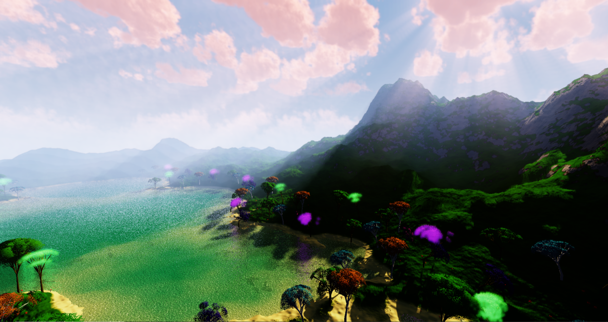

# Vertex Core
3D Rendering engine built on top of OpenGL using C++, featuring a fully procedural infinite world:

- Terrain and Water generation, with auto-LOD, on GPU, using tessellation and geometry shaders
- Procedural vegetation generated with fractal algorithms, and spawned on GPU
- Sky as gradient cubemap with procedural sundisk
- Dynamic lighting
- Cascade shadow maps
- Horizon: Zero Dawn volumetric cloudscapes
- Deferred rendering
- Screen Space grass
- Screen Space light scattering
- Screen Space reflections
- HDR Tone mapping
- Depth of Field

NOTE: Generation of procedural noise for the clouds is made using compute shaders. Depending on the GPU being used, this process can take more than 2 seconds (default maximun time a program is allowed to be executed on GPU on Windows). If this time is surpassed, the program behaviour is undetermined (crash/wrong execution).
To avoid this problem, the maximun time a program can run on GPU can be modified by editing the windows registry.